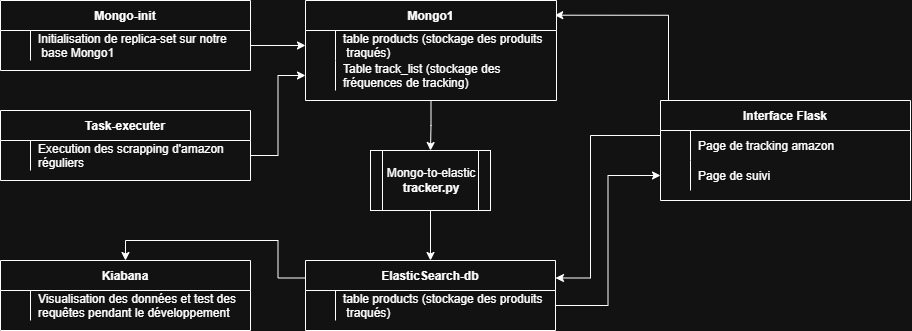
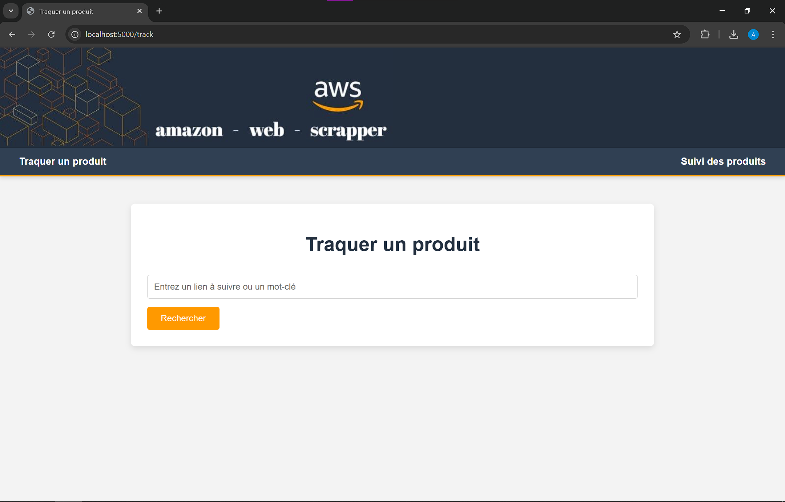
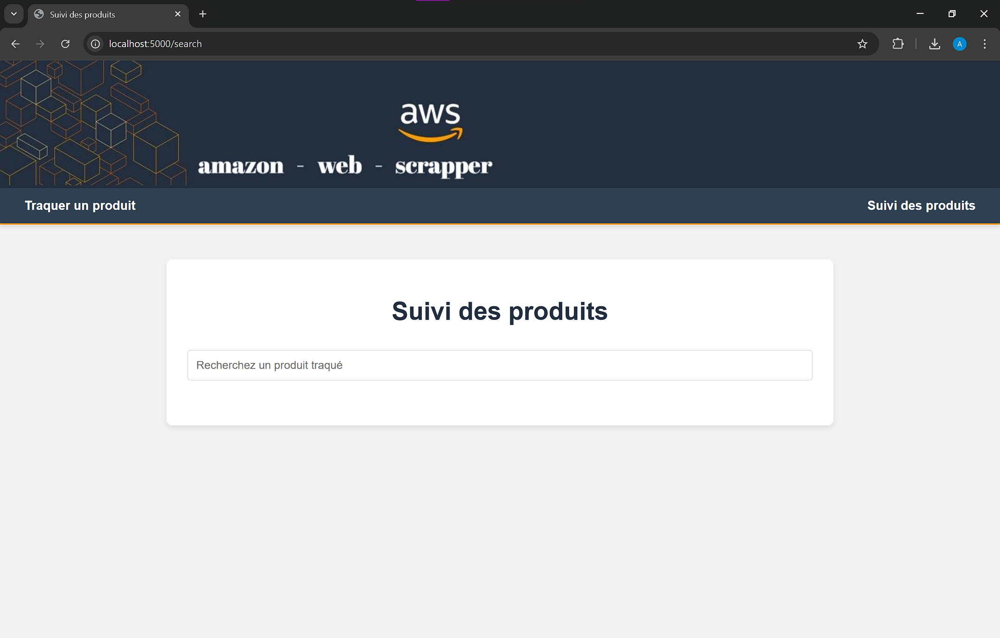
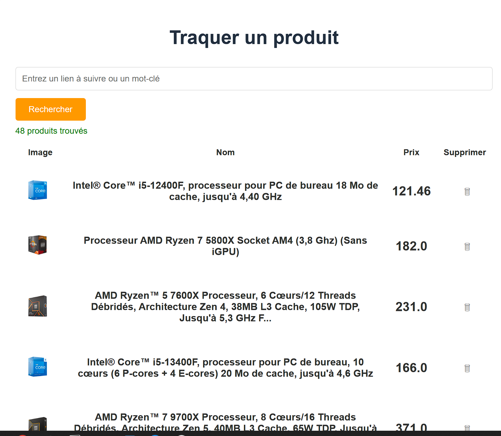
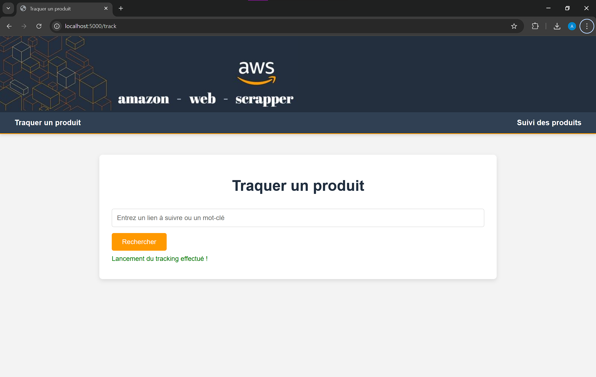
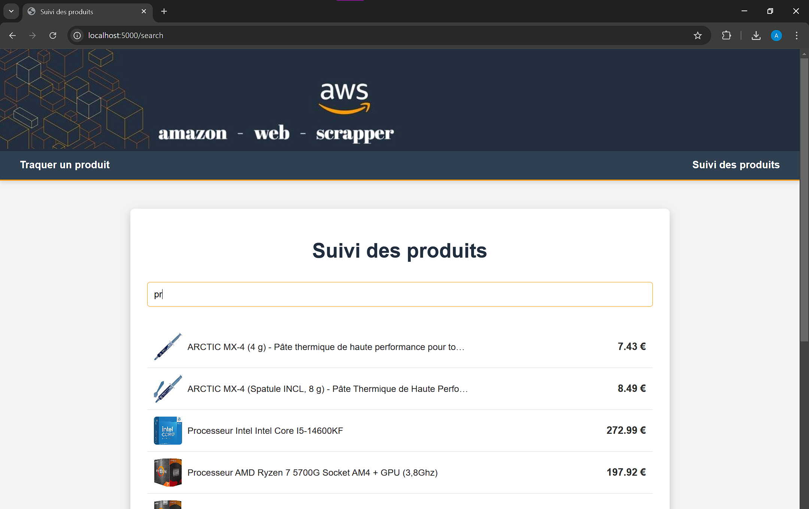
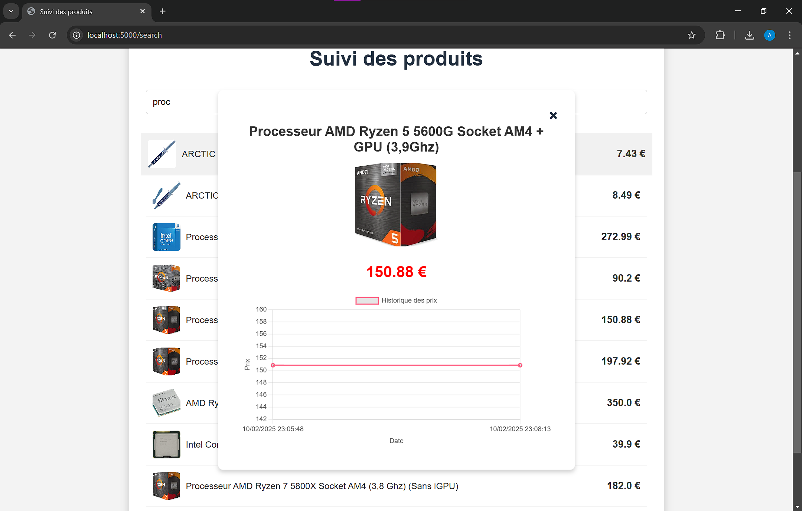

# Welcome to Amazon Web Scraper 👋


> Un projet permettant de scrapper les produits Amazon, en recherchant un mot-clé ou un lien, pour suivre l’évolution des prix et détecter les opportunités.

## Sommaire

1. [🏗️ Architecture du projet](#-architecture-du-projet)
2. [⚙️ Installation & Configuration](#⚙️-installation--configuration)
   - [1️⃣ Prérequis](#1️⃣-prérequis)
   - [2️⃣ Installation](#2️⃣-installation)
3. [🖥️ Interface Utilisateur](#🖥️-interface-utilisateur)
   - [📍 1. Recherche & Scrapping](#📍-1-recherche--scrapping)
   - [📍 2. Consultation des données scrappées](#📍-2-consultation-des-données-scrappées)
4. [🔍 Détails Techniques](#🔍-détails-techniques)
   - [📌 Scraping Amazon](#📌-scraping-amazon)
   - [📌 Variables d'environnement](#📌-variables-denvironnement)
   - [📌 MongoDB & Replica Set](#📌-mongodb--replica-set)
   - [📌 Transfert Mongo → Elastic](#📌-transfert-mongo--elastic)
5. [📡 API & Requêtes](#📡-api--requêtes)
6. [🛠️ Tests & Développement](#🛠️-tests--développement)
7. [🎥 Démo de l'Application](#🎥-démo-de-lapplication)
8. [🚀 Améliorations Futures](#🚀-améliorations-futures)


---


# 🏗️ Architecture du projet

Le projet repose sur plusieurs composants interconnectés :

- **Flask (interface graphique)** : permet d'interagir avec l'application.
- **Scraping (scrapping_script.py)** : récupère les données depuis Amazon.
- **Mongo1** : stocke les produits scrappés.
- **Task-executer** : planifie le scrapping automatique.
- **Mongo-to-Elastic** : transfert les données de MongoDB vers Elasticsearch.
- **Elasticsearch-db** : moteur de recherche et d'analyse pour afficher les historiques de prix.
- **Kibana** : visualisation avancée des données.

### 📌 Schéma global 


---

# ⚙️ Installation & Configuration

### 1️⃣ Prérequis

- **Docker & Docker Compose**
- **Python 3.9+**


### 2️⃣ Installation

Clonez le projet :

```sh
git clone https://github.com/Alexadnre/DataEngineerTools.git

```

Démarrez l'application :

```
cd DataEngineerTools/6Evaluation/Projet
docker-compose up --build -d

```

---

# 🖥️ Interface Utilisateur

L'interface graphique possède **deux pages** :

### 📍 1. Recherche & Scrapping
- Recherche par **mot-clé** ou **URL**.
- Sélection d'un **délai d'exécution automatique**.
- Exécution du scrapping via **task-executer**.




### 📍 2. Consultation des données scrappées
- Affichage des **produits stockés**.
- Graphique interactif de **l’historique des prix**.
- Auto-complétion via **Elasticsearch**.




---

# 🔍 Détails Techniques

### 📌 Scraping Amazon

**Problématique** : Amazon, étant un site avec de nombreuses protections anti-scraping, peut bloquer les tentatives de scraping, notamment en raison des vérifications basées sur les user-agents et des demandes trop fréquentes.

**Solution** :
Nous avons mis en place une série de techniques pour contourner ces protections et effectuer le scraping de manière plus efficace et discrète :

1. **Utilisation d'un User-Agent Obsolète** :
   - Après plusieurs tests, nous avons découvert qu’en utilisant un **User-Agent d'une vieille version d'Internet Explorer**, nous parvenions à éviter les blocages. Cette méthode a permis d’obtenir un accès plus stable aux pages, car Amazon ne semble pas bloquer ce type de requêtes aussi facilement.
   
2. **Délai Aléatoire entre les Requêtes** :
   - Nous avons ajouté des **délai aléatoires** entre chaque requête pour simuler un comportement plus naturel et éviter de trop solliciter le serveur Amazon.
   
3. **Rotation des User-Agents** :
   - Pour augmenter la robustesse de la solution, nous avons mis en place une **rotation des User-Agents**. Nous avons utilisé un ensemble de **User-Agents fonctionnels** trouvés durant nos tests pour éviter que le même user-agent soit utilisé de manière répétée.

4. **Utilisation de Microsoft Edge pour l'Analyse HTML** :
   - Pour mieux comprendre la structure des pages d’Amazon et savoir comment effectuer nos requêtes de scraping, nous avons utilisé **Microsoft Edge** avec la fonctionnalité permettant de charger des pages au format **Internet Explorer**. Bien que cette approche soit **moins stable** et utilise beaucoup de mémoire, elle nous a permis de mieux analyser l'HTML des pages et de définir les meilleures requêtes pour extraire les informations dont nous avons besoin.
   
Cette méthode nous a permis de contourner efficacement les protections tout en maintenant une certaine stabilité et fiabilité dans notre processus de scraping.


### 📌 Variables d'environement 
Toutes les variables d'envirnnement sont stockées dans un  **.env**, pour simplifier l'utilisation des conteneurs 

```python
# Nom des containers
MONGO_PRIMARY_CONTAINER=mongo1
MONGO_INIT_CONTAINER=mongo-init
ELASTICSEARCH_CONTAINER=elasticsearch-db
KIBANA_CONTAINER=kibana
MONGO_TRACKER_CONTAINER=mongo-tracker-py


# MongoDB

MONGO_HOST=mongo1
MONGO_PORT=27017
MONGO_REPLICA_SET=rs0
MONGO_DB=amazon_web_scraper
MONGO_DB_TABLE=products
MONGO_DB_TABLE_TRACKER=track_list

# Elasticsearch
ELASTIC_HOST=elasticsearch
ELASTIC_PORT=9200

# Kibana
KIBANA_PORT=5601

# Flask
FLASK_APP=app.py
FLASK_ENV=development


TASK_EXECUTER_CONTAINER=task-executer
```
### 📌 MongoDB & Replica Set
Les données sont stockées dans **MongoDB**, configuré en **Replica Set** pour assurer la synchronisation et la durabilité.

Extrait du `docker-compose.yml` :

```yaml
services:
  mongo1:
    image: mongo:6
    container_name: ${MONGO_PRIMARY_CONTAINER}
    command: ["mongod", "--replSet", "${MONGO_REPLICA_SET}", "--bind_ip_all"]
    ports:
      - "${MONGO_PORT}:${MONGO_PORT}"
    volumes:
      - mongo-data:/data/db
    networks:
      - mongo-cluster
```

### 📌 Transfert Mongo → Elastic
Les produits sont transférés vers **Elasticsearch** grâce à `mongo_to_elastic/tracker.py` en exploitant **MongoDB Replica Set**.

Extrait du code :

```python
pipeline = [
    {
        "$match": {
            "operationType": {"$in": ["insert", "update", "delete"]},  # Filtrer pour insert, update, delete
            "ns.coll": MONGO_DB_TABLE  # Filtrer pour la collection spécifique
        }
    }
]   

# Surveiller les changements et les envoyer à Elasticsearch
with db.watch(pipeline) #...
```

---

# 📡 API & Requêtes

L’interface utilise plusieurs **endpoints** :

| Endpoint                       | Méthode | Description |
|---------------------------------|---------|-------------|
| `/scrape`                       | `POST`  | Lance le scrapping pour un mot-clé ou une URL d'Amazon. |
| `/products`                     | `GET`   | Récupère tous les produits stockés dans la base de données MongoDB. |
| `/history/<product_id>`         | `GET`   | Retourne l'historique des prix pour un produit spécifique. |
| `/track`                        | `GET`, `POST` | Permet de suivre l'ajout de produits et de lancer des processus de suivi des prix. |
| `/delete_product`               | `POST`  | Permet de supprimer un produit de la liste de suivi par son `asin`. |
| `/check_connections`            | `GET`   | Vérifie la connexion à MongoDB et Elasticsearch. |
| `/autocomplete`                 | `GET`   | Fournit une auto-complétion de produits en fonction de la requête de recherche. |
| `/product/<product_id>`         | `GET`   | Retourne les détails d'un produit à partir de son `product_id` (ASIN). |

➡️ **Extrait JSON d'un produit scrappé.**
```json
{'name': "NiPoGi AM06 Pro Mini PC 32 Go DDR5 RAM, АMD Ryzen 7 6800H(8C/16T, jusqu'à 4,7 GHz), 512Go M.2 SSD Mini Ordinateur de Burea...", 'price': 399.99, 'asin': 'B0DT3DN71D', 'url': 'https://www.amazon.fr/dp/B0DT3DN71D', 'image_url': 'https://m.media-amazon.com/images/I/71NuJFbTBCL._AC_UL320_.jpg'}
```
---

# 🛠️ Tests & Développement

### Fichiers de test :

- `test/test_mongo_connection.py` : vérifie la connexion MongoDB.
- `test/test_mongo_request.py` : teste les requêtes Mongo.
- `test/test_update.py` : vérifie la mise à jour des prix.

---


# 🎥 Démo de l'Application

### Stockage et mise à jour des données

Aucune donnée n'est stockée de base dans l'application. Toutes les informations sont récupérées en temps réel, après avoir suivi un produit. Le suivi des produits s'effectue de manière dynamique et les données sont mises à jour directement après chaque action de suivi.

Pour ajuster la fréquence du suivi automatique, l'intervalle de mise à jour peut être configuré. Par défaut, l'intervalle est défini en heures, mais il est possible de le personnaliser pour effectuer des mises à jour plus fréquentes (par minute ou par seconde). 

Cela est néant-moins déconseillé, car augemnter la fréquence des requettes augmente la chance qu'amazon bloque notre bot de scrapping. Cette section sert seulement à vérifier le bon fonctionnement du code sans attendre plusieures heures

Pour cela, modifie le fichier `task-executer\task_executer.py`, **ligne 93** :

```python
interval = timedelta(hours=task["interval_hours"])  # /!\ intervale en heures
```
Il est ici possible de remplacer **hours=** par **minutes=** ou **seconds=** 
---
Voici maintenant une présentation des différentes étapes d'utilisation de l'application, accompagnée de captures d'écran pour chaque étape clé.

## 1️⃣ **Page d'Accueil**

Lorsque vous accédez à l'application, vous êtes accueilli par la page d'accueil. Vous y trouverez les options pour commencer une recherche par mot-clé ou par URL, ainsi qu'un bouton pour visualiser les produits suivis.


---

## 2️⃣ **Recherche et Scrapping**

Dans cette section, vous pouvez entrer un mot-clé ou une URL de produit Amazon pour commencer le processus de scrapping. Vous pouvez également définir un délai d'exécution automatique pour le scrapping.

- **Entrée d'un mot-clé ou d'une URL** :
  


- **Configuration du délai d'exécution automatique** :


---

## 3️⃣ **Exécution du Scrapping**

Une fois la recherche lancée, l'application commence à scrapper les données des produits Amazon. Voici un aperçu de l'interface pendant l'exécution du scrapping.



---

## 4️⃣ **Rechercher avec Auto-Complétion**

Grâce à Elasticsearch, l'application vous permet de rechercher facilement des produits avec une fonction d'auto-complétion. Voici un aperçu de la recherche avec auto-complétion en action.




---

## 5️⃣ **Suivi des Produits**

Après l'exécution du scrapping, vous pouvez consulter la liste des produits scrappés. Vous pouvez voir des informations comme le prix, le nom du produit, et un graphique interactif montrant l'évolution du prix dans le temps.


- **Historique des prix** :




---

## 6️⃣ **Alertes sur les Baisses de Prix** (Fonctionnalité à venir)

Une fonctionnalité en développement permet de recevoir des alertes lorsque les prix d'un produit baissent. Vous recevrez ces alertes par email ou SMS selon vos préférences.


---

Ces étapes montrent comment l'application permet d'effectuer un scrapping de produits Amazon et de suivre l'évolution de leurs prix. N'hésitez pas à tester l'application et à explorer ces différentes fonctionnalités!


# 🚀 Améliorations Futures


### 1️⃣ Intégration de Notifications pour Alerter sur les Baisses de Prix 📩
**Objectif** : Ajouter un système de notification pour alerter les utilisateurs des baisses de prix des produits suivis.

- **Approche** : 
  - Implémenter un système de tâches planifiées via **Flask** qui vérifiera périodiquement les prix des produits dans la base de données.
  - Lorsqu'une baisse de prix est détectée, une notification sera envoyée via un service comme **Twilio** (SMS) ou **SendGrid** (email).
  
- **Technologies** :
  - Utilisation de **Flask-Mail** pour l'envoi d'emails ou **Flask-SocketIO** pour les notifications en temps réel sur l'interface utilisateur.
  - Intégration d'un service tiers pour les notifications par SMS (par exemple, Twilio).

### 2️⃣ Amélioration du Moteur de Recherche via NLP 🤖
**Objectif** : Améliorer l'auto-complétion et la recherche en utilisant des techniques de **traitement du langage naturel (NLP)**.

- **Approche** : 
  - Compléter le moteur de recherche **Elasticsearch** avec des modèles **NLP** pour mieux comprendre et traiter les requêtes des utilisateurs.
  - Utiliser des bibliothèques telles que **spaCy** ou **Transformers** (par exemple, **BERT**) pour améliorer la pertinence des suggestions d'auto-complétion et des résultats de recherche.
  
- **Technologies** :
  - Intégration de **spaCy** pour l'analyse linguistique et la catégorisation des termes de recherche.
  - Utilisation de modèles pré-entrainés comme **BERT** ou **DistilBERT** pour l'analyse sémantique des requêtes.

### 3️⃣ Amélioration de l'Interface Utilisateur 🌐
**Objectif** : Refondre l'interface graphique pour améliorer l'expérience utilisateur.

- **Approche** : 
  - Ajouter des éléments d'interface tels que des graphiques en temps réel des baisses de prix, une meilleure présentation des historiques de prix, et des alertes visuelles.
  - Introduire des **animations CSS** pour une expérience plus fluide et interactive.
  - Ajouter des filtres avancés pour trier les produits par catégorie, prix, ou score moyen des avis.
  
- **Technologies** :
  - Utilisation de **JavaScript** et **React.js** pour une interface plus dynamique.
  - Ajouter un graphique interactif avec **Plotly** ou **D3.js** pour visualiser l'évolution des prix.
  
### 4️⃣ Fonctionnalité de Suppression de Produit sur l'Interface 🎯
**Objectif** : Permettre à l'utilisateur de supprimer facilement un produit de la liste de suivi via l'interface graphique.

- **Approche** : 
  - Ajouter un bouton "Supprimer" à côté de chaque produit dans la liste de suivi.
  - Lorsque l'utilisateur clique sur "Supprimer", la base de données sera mise à jour pour retirer le produit, et l'interface sera réactualisée.
  
- **Technologies** :
  - Utilisation de **JavaScript** pour la mise à jour dynamique de l'interface.
  - Intégration de l'API backend pour supprimer les produits dans la base de données MongoDB.

### 5️⃣ Amélioration de l'API pour Supporter plus de Formats de Données 🔄
**Objectif** : Étendre l'API pour accepter et renvoyer des données dans plus de formats, tels que CSV ou XML.

- **Approche** : 
  - Ajouter des options dans les requêtes API pour exporter les produits et leurs historiques sous forme de **fichiers CSV** ou **XML**.
  - Implémenter des routes API supplémentaires pour la conversion et l'exportation de données.
  
- **Technologies** :
  - Utilisation de la bibliothèque **pandas** pour générer les fichiers CSV.
  - Utilisation de **xml.etree.ElementTree** pour gérer les exportations au format XML.

### 6️⃣ Exemple de Scraping Hébergé sur AWS

Une version web du projet devait initialement être hébergée sur **AWS** afin de fournir un exemple de scraping en continu. Cette version aurait permis de démontrer l'efficacité du scraping sur une longue période et de montrer les données en temps réel. Cependant, nous avons rencontré plusieurs défis techniques :

- **Problème avec Elasticsearch** : L'instance AWS **t2 du tiers gratuit** était insuffisante pour supporter la charge d'**Elasticsearch**, qui est très gourmand en ressources. Même après avoir mis à niveau l'instance vers une machine plus puissante et configuré les ports correctement, nous n'avons pas réussi à charger **Flask** correctement, en raison d'un problème d'ouverture des ports sur AWS.
  
- **Solution à Long Terme** : Ce problème peut être résolu avec **plus de temps** pour ajuster la configuration du serveur, optimiser les performances d'Elasticsearch et tester différentes configurations de ressources.

---


# ✨ Auteurs

👤 **Alexandre Videlaine & Parys Noyon**

- Github: [@Alexadnre](https://github.com/Alexadnre)
- Github: [@Parysnm](https://github.com/Parysnm)
